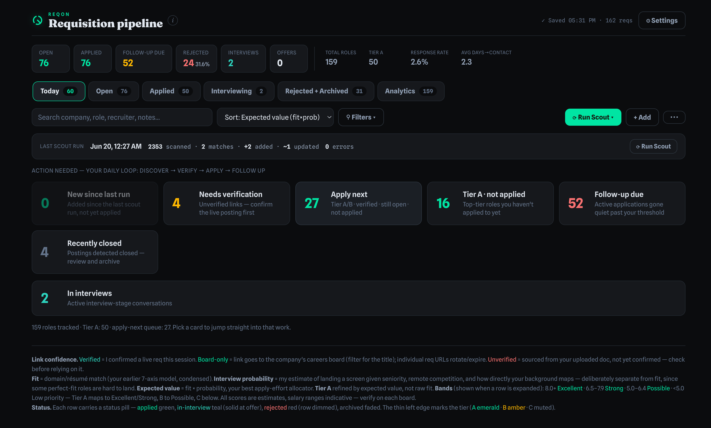
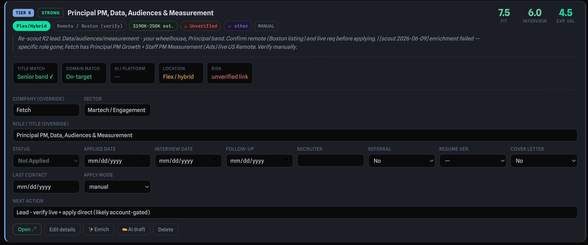
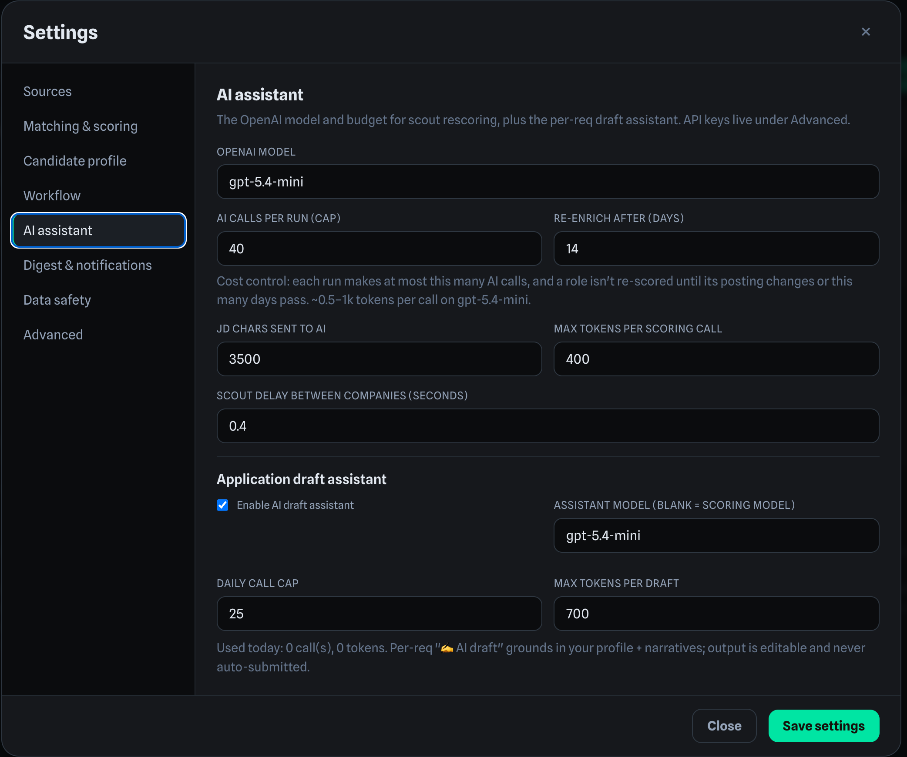
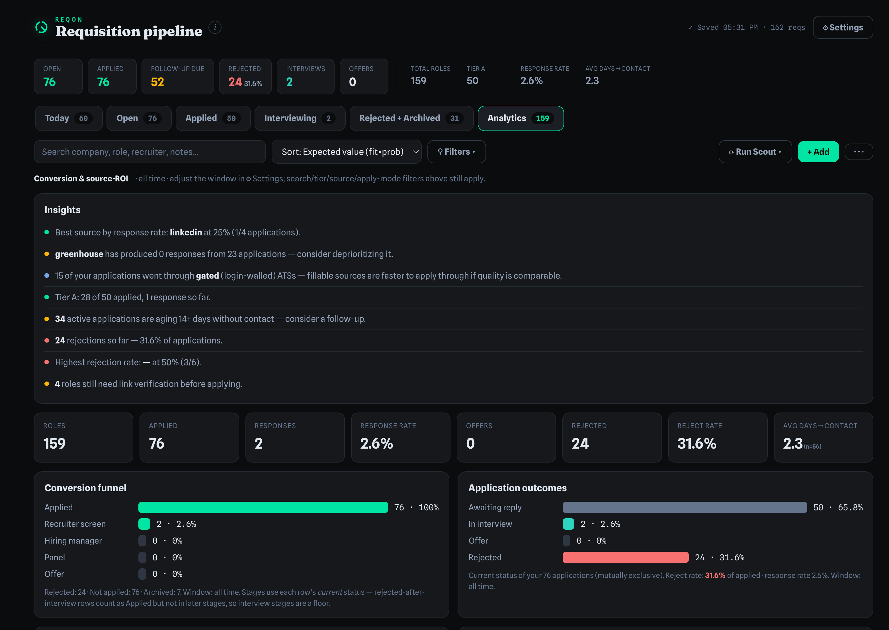
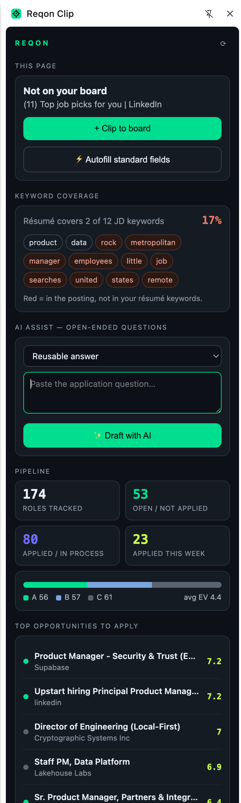
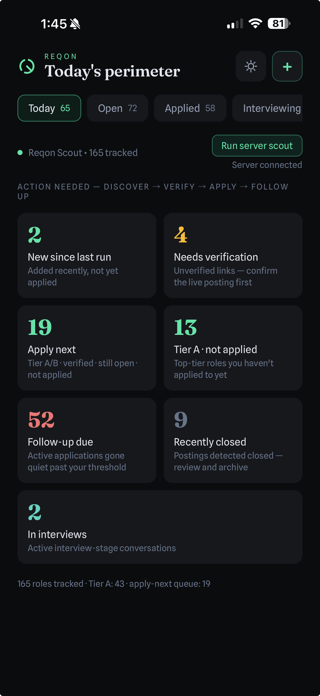

# Reqon — AI-Assisted Job Search CRM

Reqon is a self-hosted, config-driven job-search CRM for managing role discovery, application tracking, recruiter follow-up, screening preparation, and decision support.

It combines structured pipeline workflows, a deterministic multi-ATS scout, optional AI assistance, Gmail response ingest, analytics, and companion experiences across web, iOS/iPad, and Chrome.

The product is designed around one core principle: AI should assist the workflow without taking control from the user. Scoring, recommendations, cover notes, and screening answers are reviewable, editable, budget-capped, and never auto-submitted.

## Why I Built This

Most job searches become scattered across spreadsheets, browser tabs, email threads, saved postings, LinkedIn messages, and personal notes. That creates three problems:

* Good-fit roles are easy to miss.
* Follow-ups and recruiter responses are easy to drop.
* Application decisions become inconsistent and hard to prioritize.

Reqon turns that messy workflow into a structured product system: roles are captured, scored, grouped, researched, tracked, and reviewed through a repeatable pipeline.

## Product Preview



_The main command-center board groups opportunities by lifecycle stage, fit, priority, hygiene status, and apply-next queue._



_Opportunity detail view with role metadata, scoring, notes, status, follow-up tracking, and decision support._



_AI assistance is grounded in the candidate profile and narrative library, with editable outputs and human-in-the-loop review._



_Pipeline analytics — tier mix, status breakdown, applications over time, and expected-value-ranked opportunities to act on next._



_Reqon Clip browser extension — clip postings, see fit/EV inline, autofill standard fields, draft answers, and a board-synced side panel, all writing back to your self-hosted pipeline._



_The mobile companion app — your pipeline on the go, synced to the same self-hosted board._

## Core Workflows

* Pipeline management — requisitions grouped into lifecycle tabs: Open, Applied, Interviewing, and Rejected/Archived.
* Apply-next prioritization — EV-sorted queue based on fit, probability, tier, remote status, and domain alignment.
* Hygiene lanes — needs-verify, follow-up-due, and closed-req lanes to reduce wasted applications and missed follow-ups.
* Deterministic scout — polls public ATS board APIs including Greenhouse, Ashby, Lever, Workable, SmartRecruiters, Recruitee, Personio, Teamtailor, and Workday. Works with no API key.
* Candidate profile — résumé upload extracts weighted keywords, applicant info, role preferences, sector preferences, and reusable narrative content.
* Optional AI assist — résumé-aware rescoring, cover-note drafting, screening-answer support, and research synthesis. Budget-capped, editable, and never auto-submitted.
* Analytics — conversion funnel, response rates, offer rates, source performance, and pipeline health.
* Morning digest — scheduled summary of new finds, follow-ups, and closed roles via Slack, email, or file fallback.
* Data safety — every save snapshots first, destructive saves are rejected, and Settings supports snapshot/restore and retention.
* iOS/iPad companion app — React Native / Expo companion for pipeline, Today command center, analytics, candidate profile, and apply-assist workflows.
* Chrome extension — clips postings, overlays fit signals on job pages, marks roles applied, and fills factual application fields on supported ATS pages.
* Gmail response ingest — reads recruiter replies, auto-sets confident rejections, and flags interviews/offers for review.

## Product Decisions

* Built around structured opportunity records instead of freeform notes or a spreadsheet.
* Used deterministic workflows for discovery, scoring, dedupe, merge, status changes, and safety checks.
* Kept AI assistance optional, reviewable, and human-controlled.
* Treated privacy as a product requirement: personal data, résumé files, credentials, and live pipeline data are gitignored.
* Designed companion surfaces for different jobs: web for command-center management, mobile for quick review, Chrome for capture, and Gmail ingest for pipeline freshness.
* Prioritized workflow reliability over flashy automation: the system should help make better decisions, not silently act on the user’s behalf.
* Made Excel an export path rather than the system of record, preserving structured state, workflow integrity, and auditability.

## What This Demonstrates**

**Reqon reflects how I think about product systems:**

* Turn messy real-world workflows into structured, repeatable processes.
* Combine product strategy, data modeling, automation, AI assistance, and user control.
* Use AI to improve decision quality while preserving trust and reviewability.
* Design for multiple surfaces without simply copying the same experience everywhere.
* Build practical tools that solve real user problems end-to-end.

## Architecture

Reqon runs as a small self-hosted Node/Express application with a server-backed web UI, mobile view, optional companion clients, and local file persistence.

* **Web board** — dark command-center interface served by the Node/Express app.
* **Persistence** — edits are written to data.json on disk with snapshot/restore support and corruption protection.
* **Configuration** — sources, filters, profile settings, digest options, and optional AI settings are managed through the Settings UI.
* **Scout agent** — Python-based deterministic scanner that polls supported public ATS board APIs, filters roles, scores fit, dedupes, and merges new opportunities append-only.
* **Mobile companion** — React Native / Expo app for pipeline review, Today command center, analytics, profile, and apply-assist workflows.
* **Chrome extension** — browser companion for clipping job postings, viewing fit overlays, marking roles applied, and assisting with factual field fill.
* **Gmail ingest** — server-side IMAP workflow that reads recruiter replies, auto-sets confident rejections, and flags interviews/offers for review.
* **Optional AI layer** — résumé-aware rescoring, cover-note drafting, screening-answer support, and research synthesis with budget caps and human review.

Excel is available as an on-demand export, but it is not the live database.

## Quick start

```bash
git clone <this-repo> reqon && cd reqon
npm install
npm start        # http://localhost:8787  (board)  ·  /m  (mobile)
```

Requires **Node 18+**. A fresh clone boots from `seed.example.json` (sample data). Open
**Settings** to configure sources, filters, your profile (upload a résumé), and optional AI/
digest features. Nothing requires hand-editing a file.

On macOS you can register auto-start (launchd) with `./install.sh`.

## Configuration

| Where it's stored | What | How you set it |
|---|---|---|
| `agent/boards.json` | companies, sources on/off, tiers, employment skips, tab mapping, hygiene, apply-mode map | Settings UI |
| `agent/watchlist.json` | keywords, titles, min-fit, blockers | Settings UI |
| `agent/profile.json` | applicant info, résumé keywords, narratives, prefs *(gitignored)* | Settings → Candidate profile (résumé upload) |
| `.env` | secrets + budgets: `OPENAI_API_KEY`, assistant/digest/SMTP, backup retention *(gitignored)* | Settings UI (secrets masked) |

See `.env.example` for every optional variable. The scout details live in `agent/SCOUT.md`.

## Scout

```bash
python3 agent/scout.py --dry-run        # preview; writes nothing
python3 agent/scout.py                   # merge new roles into data.json
bash tests/run.sh                        # unit tests (stdlib, no deps)
```

Add a company without editing JSON: **Settings → Add company by careers URL** (paste a board
URL; it detects the ATS + slug). Per-source run health is shown in Settings.

## Mobile App & Chrome Extension

**iOS / iPad app** (`app/`, Expo SDK 56) — runs in **Expo Go**, so no Apple Developer account
or Xcode is needed to use it on your own device:

```bash
cd app && npm install
npx expo start          # then open the link in Expo Go (device on the same network)
```

iPad lays out as a master-detail command center (3-pane in landscape, 2-pane in portrait);
phone is single-column. **Connect it without typing:** on the board, **Settings → Advanced →
Pair a device** shows a QR; in the app, **Settings → Sync → Scan QR** (or paste the code) fills
the server URL + passphrase (stored in the device keychain). The native **Share Extension**
(Safari → Add to CRM) and **push notifications** require an EAS/Xcode dev build — not in Expo Go.

**Chrome extension** (`extension/`) — load unpacked: `chrome://extensions` → enable *Developer
mode* → *Load unpacked* → select `extension/`. Set your server origin + token in the extension's
options. Then the toolbar button clips the current tab, a fit overlay appears on tracked/known
job pages, "Mark Applied" writes the status back, and apply-assist fills factual fields on
Greenhouse / Ashby / Lever (it never touches EEO, consent, or the submit button).

## Gmail Response Ingest

Keeps the board current as recruiters reply — **auto-sets confident rejections** and **flags
interviews/offers** for review (it never auto-advances a positive; a misread shouldn't move your
pipeline). Reads Gmail over IMAP with an **App Password** (2-Step Verification → App passwords),
matches conservatively (the company name must appear *and* there must be exactly one active
applied row), and writes through the audited update path. Deterministic keyword rules by default;
optional AI for the ambiguous ones.

Set it up two ways — both store credentials on the server and run there:
- **From the app:** Settings → Sync → *Gmail response ingest* (address, App Password, label) →
  **Test (dry-run)** → **Run now**.
- **From `.env` / CLI:** `GMAIL_USER` + `GMAIL_APP_PASSWORD`, then `python3 agent/mail_ingest.py`
  (dry-run) → `--apply`. The daily scout runner (`run-mail.sh`) also runs it automatically.

Full guide: [`agent/MAIL.md`](agent/MAIL.md).

## Data & Privacy

`data.json` (your pipeline), `agent/profile.json` (your résumé-derived profile), résumé source
files, `seed.json`, `agent/found-log.md`, `.env`, and `backups/` are **gitignored** — no personal
data is committed. Generic `*.example.json` files ship for fresh clones. The board is LAN-only by
default; set `APP_TOKEN` to require a passphrase before exposing it.

Edits sync across the board, the app, and the extension through the server (`/api/sync`), and
deletes are **soft (tombstones)** — removing a row on one surface won't have it resurrected by
another device that hadn't seen the delete yet.

## License

MIT — see [LICENSE](LICENSE). Contributions welcome; see [CONTRIBUTING.md](CONTRIBUTING.md).
